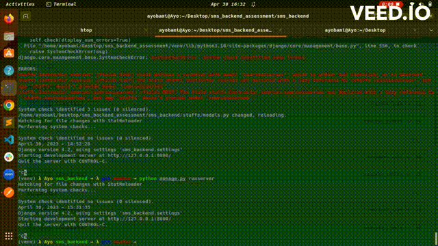

# **Backend Engineer Assessment**.

## **Building an SMS backend application.**

### **Kindly read the instructions and requirements clearly.**

**Requirements:**

1. A microservice application that breaks down all the core module of school management system
   into microservices.
2. A CRUD services on each of the respective micro services
3. A RESTFUL API controller implementing only GET/POST requests
4. A swagger interface for a API documentation
5. An admin profile for teacher and super admin
6. A student profile

**Overview**

A school management system can be defined as a platform designed to enable the efficient running of
your institution through digitization and automation of various academic and administrative operations.

Project Goal: Study popular school management application and create as much services as possible.
List of functional services provided or completed would be used in taking a decision.

Step 1: Evaluating and understanding what a school management system is.

Step 2: Creating your database architecture and implementing it

Step 3: Planning your software architecture, modules and breaking them into microservices.

Step 4: Implementing those microservices and creating RESTFUL controller for the respective
microservices

Step 5: Creating Different profile has listed below and their privileges

Step 6: Deploying a swagger UI for exposing the RESTFULL controllers

Step 6: Create an Instructor to create a course and module and also ability to delete it.

## Set up and test

### Install dependencies

```bash
python3 -m venv venv
```

```bash
source venv/bin/activate
```

```bash
pip install -r requirements.txt
```

### Run the application

```bash
python3 manage.py runserver
```

### Swagger UI

```bash
http://127.0.0.1:8000/swagger/
```



### Postman

```bash
http://localhost:8000/api/students/
```


